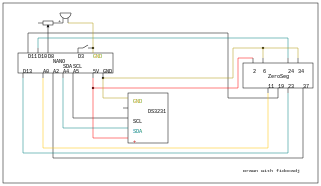

# 0clock

Clock using Nano, 0seg (zerosegment display) and DS3231.

Install "RTClib by Adafruit".


## Resetting time

Run
```
python3 settime.py
```

## Schematics



```
Zeroseg
2 5V
6 GND
11 SW1 - left switch
19 MOSI
23 CLK
24 CS
34 GND (for SW2)
37 SW2 - right switch

SYM   NANO  DS  ZS
SW1   A0        11
SW2   A2        37
SDA   A4    D
SCL   A5    C
SW0   D3 
BZR   D8 
CS    D10       24
MOSI  D11       19
CLK   D13       23

DS - DS3231 clock
ZS - Zeroseg display
```
