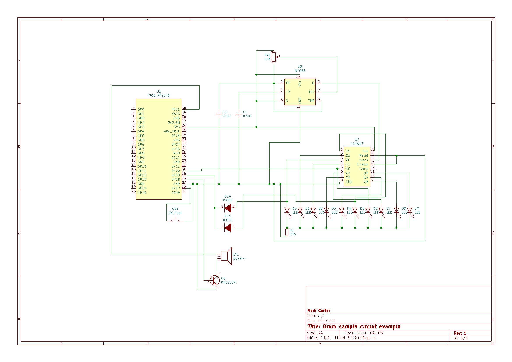

# Drum sample

Plays a drum sample whenever a pushbutton is pressed. You can change it to whatever sample
you want, though. Maybe you'd want to add more samples, or have it trigger from a 
sequencer. The world's you lobster when it comes to expanding on the basic idea.

The code assumes a 44100 Hz sample rate using 8 bit unsigned sample values, mono output.

It uses PWM output.

You can download a samples from the web. Use Audacity to convert the sample to
a "raw" format of the type stipulated above. 

You need to convert the raw file into a C++ file. Use the `mkdata` command that you see.
it uses the `xxd` command, which needs to be installed. You can adapt it to your needs. It
is a very simple script.

Compile the project in the "usual way". Connect a button to GPIO17. Connect a speaker to GPIO15.

If the sound isn't loud enough you can use a transistor to amplify it: connect a speaker
to either 5V or 3V3 of the Pico, and the other terminal to the collector of an NPN transistor. 
A 2222A works OK. Connect GPIO15 to the base of the transistor. Connect the emitter to ground.
It will be substantially louder then.

## Connections

**GP17** (SW) is a pulled-up input with debounce logic. Connect a push-button to this pin
if you want to manually trigger the sample. Triggering occurs on a falling edge, i.e. when
the button is pressed down. Leave disconnected if you are not interested in this functionality.

**GP18** (SPK) is output. Connect your speaker to this pin.

**GP19** (TRIG1) is a floating input trigger. Output is triggered when the pin detects a rising voltage.
Connect to ground if not it use to as to avoid the floating pin triggering the output.

**GP20** (TRIG2) is an alternative floating input trigger. It is an alternative to TRIG1.

The reason that there are two floating input triggers is to act as a distinguishing input in case
one trigger is not enough. This covers the scenario of, say, when you want the drum to be
triggered by consecutive pulses from a decade counter. The Pico would be unable to distinguish
a transition from one pin to the next as a rising edge, so two independent triggers are available.

Where two or more inputs are being used on a trigger pin, use diodes to act as OR gates. You may
find that the Pico is not triggering if you don't. (See the example schematic below).

## Example sequencer circuit

Below is a circuit that combines an NE555 to act as a low-frequency clock to a CD4017 decade counter.
This creates a "sequencer". There is a bank of LEDs showing which pin is currently active. The LEDs
should light up left-to-right in sequence.

Vary the speed of the sequencer by adjusting the variable potentiometer (RV1). Experiment with differing
values of C2 an RV1 to obtain differing time scales.

In the circuit, decade outputs Q0, Q5 and Q6 have been used to trigger the drum. You could of course
vary these. Note that TRIG1 (GPIO19) have multiple inputs, and so require diodes. 
Note also that Q5 and Q6 are contiguous outputs, and so require different triggers in order
for rises to be detected. Q5 is connected to TRIG1 as previously stated, whilst
Q6 is connected to TRIG2 (GP20).

The speaker has been connected to the output via a transistor so as to amplify output.
This does not strictly speaking need to be done. A speaker could be connected to
GP24 and GND, although the output will be quieter.

## Example drum-bart circuit (much simpler)

It is possible to simplify the above circuit it you just want to create a pulsing
drum. Remove the CD4017, LEDs and diodes from the circuit. Instead of connecting
the NE555's pin3 to the CD4017 clock pin, connect it to TRIG1 directly. 
Connect TRIG2 to GND so that no spurious triggers are generated.

## News

2021-04-02 Started. Working

