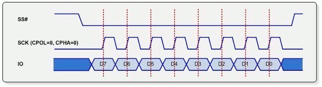

# SPI

## Pinouts

```
NAME	  WROOM		Pi3	STM32	NANO	STM8	DUP	DUP
	---------
	VSPI HSPI
CLK	 D18  D14	23	PA5	D13	PC5	WHITE	GREEN
MISO	 D19  D12	21	PA6	D12	PC7	GREY	YELLOW
MOSI	 D23  D13	19	PA7	D11	PC6	PURPLE	ORANGE
CS	 D05  D15	24	PA4	D10	PA3	BLACK	BLUE

WROOM	- GPIO PINOUT ON ESP32-WROOM (VSPI and HSPI)
Pi3	- PINOUTS ON PI3 PHYSICAL BOARD PINS (default is VSPI)
STM32	- BLUE PILL (Default as used by stm-spi-slave example)
NANO	- NANO or UNO
DUP	- SUGGESTED DUPONT COLOURS
```

## Implementation examples

* [nano-spi](nano-spi.md) - discussion of the master and slave in this irectory

* [rpi-master-spi.py](rpi-master-spi.py) - example which has been proven to work
* [rpi-spi-master-bcm2835](rpi-spi-master-bcm2835) - connects to the regular SPI slave on Raspbian
* [stm32-spi-master-arduino](stm32-spi-master-arduino)
* [stm32-spi-master-bare](../stm32/bare/stm32-spi-master-bare)
* [stm32-spi-slave-arduino](stm32-sp-slave)
* [stm32-spi-slave-mbed](https://os.mbed.com/users/blippy/code/spi-slave/)
* [stm8-spi-master-bare](../stm8s103f3p6/bare/08-spi-master)
* [stm8-spi-slave-bare](../stm8s103f3p6/bare/09-spi-slave)


## Unclassified

* MODE 0: data is sampled at the leading rising edge



## Links to other sites

* [Basics of SPI](https://www.electronicshub.org/basics-serial-peripheral-interface-spi/)
