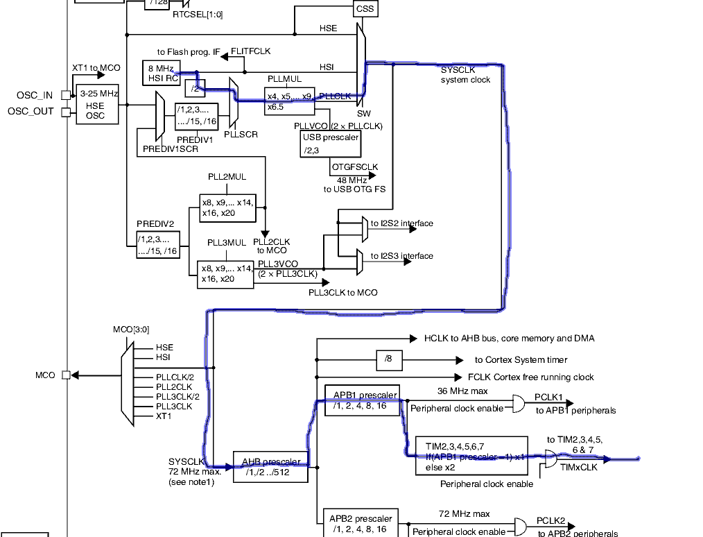

# play a hard-coded track using PWM

Keys: IRQ, PWM, audio, clock, timers

In this project, we play a hard-coded voice recording. It builds on 
[project 12](../12-pwm-interrupts). You should review that project to learn about things like timer prescalers, channels, and preloading of timer resets.

The recording is in file `track.h`, which encodes a RAW audio file at a frequency of 8kHz, where each sample (a volume reading) is an unsigned byte. There is a problem, though: an 8kHz frequency is within the human hearing range. If you use PWM at that frequency, then you will be able to hear this "carrier frequency" during playback. It's very annoying.

The fix is to choose a higher frequncy like 16kHz. 
Although still technically within the range of human hearing, it is undiscernable. 
Maybe the younglings out there will be able to detect it, but not me.

Doubling the frequency to 16kHZ creates some extra problems. One of them is in the interrupt handler. Our audio was sampled at 8kHz, but is played at 16kHz. So we must scale our lookup into the audio track by a factor of a half. So rather than our interrupt handler looking like this:

```
void TIM3_IRQHandler()
{
        // increment the PWM counter for when to set low
        static u32 idx=0;
        if(idx >= track_raw_len) idx = 0;
        TIM3->CCR1 = (u32) track_raw[idx];
        idx++;

        TIM3->SR &= ~TIM_SR1_UIF; // reset interrupt flag
}
```

it has to look like this:
```
void TIM3_IRQHandler()
{
        // increment the PWM counter for when to set low
        static u32 idx=0;
        if(idx >= 2*track_raw_len) idx = 0;
        TIM3->CCR1 = (u32) track_raw[idx/2];
        idx++;

        TIM3->SR &= ~TIM_SR1_UIF; // reset interrupt flag
}
```

Now, the track samples are an unsigned byte, so we set:
```
        TIM3->ARR = 255;
```
Recall that ARR is the Auto Reset Register. So the sample volume corresponds exactly to the duty cycle. Better quality audio is likely to be had at 10 or 12 bits; but that is not considered here.

Recall from the previous project that it implies that the timer prescaler must be set according to formula:
```
psc = fclk/ fpwm/(arr+1) -1
```

Here, fclk = 8MHz is the default system clock, fpwm is 16kHz as we decided above, and arr=255. Plugging these numbers in:
```
psc = 8000000/16000/256 -1 = 0.953..
```

I may have been able to get away with setting PSC (prescaler) to either 0 or 1, but what
I choose to do instead was increase the system clock to give me better timing accuracy.

This leads us down the rabbit hole of the *Clock Tree*, figure 11 on page 125 of the STM32 datasheet. I haven't quite figured things out yet, but as far as I can determine, the blue pill has two clock sources: one internal to the chip, and an external oscillator 8MHz wired to the board itself.

Follow the traces in diagram below to see how I figured things out:



We want to use PLLMUL to scale up out clock. The clock starts out at the familiar default of 8MHz,
and then is divided by 2. I'm not sure why the MCU does this. If we then set PLLMUL to scale by 8,
then our resulting SYSCLK frequency will be 8/2*8 = 32MHz. We don't mess with the other prescalers like AHB and APB1, so the final clock frequency of TIM3 will 32MHz.

We set up this clock in `main()`:
```
void main()
{
        // change the system core clock from 8MHz to 32MHz
        RCC_CFGR |= 0b0110 << RCC_CFGR_PLLMUL; // PLLMUL 8X
        RCC_CFGR |= 0b10;  //PLL selected as system clock
        while(RCC_CR & RCC_CR_PLLRDY);
        RCC_CR |= RCC_CR_PLLON;
        SystemCoreClock = 32000000UL; // tell everyone about new speed

	...
}
```
We adjust `RCC_CFGR` to set the PLLMUL to 8X (refer to the register so 
see what multipliers can be used), and select the PLL. 
Then, in `RCC_CR` we actually switch to PLL.

We need to set `SystemCoreClock` so that other timed services like 
usart know how to compute the correct transfer rates.


Our revised figure to psc is therefore:
```
psc = 32000000/16000/256/256 -1 = 6.8125
```
Hence, in `setup_timer()` we choose:
```
        TIM3->PSC = 7;
```

As in the previous project, plug a speaker into pin PA6, and its other lead to ground. 
Upload the sketch, and you should hear the words "that does not compute."

I am happy with the way this project works. I actually prefer it to using a DAC like the MCP4921. 
The output quality seems pretty good, and I have no real complaints. 
It also means that I don't have to fiddle with extra components, set up SPI, and soforth. 
The output from the MCP4921 is often rather weak, and in need of amplification. 
With the current setup all of that can be dispensed with.

Now all that remains for me to do is figure out how to read SD cards, then we can
build ourselves a little music player.


Works 2020-10-21

