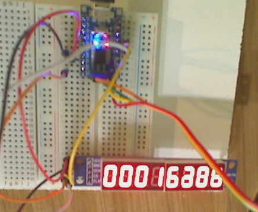

# stm8 connect to max7219 (7-segment display)

Status: working

Hookup: CS=PA3, CLK=PC5, DIN (MISO)=PC7. MOSI not needed. VCC=5V (even on this device).

## Also on this site

* [zeroseg](../../../zeroseg)
